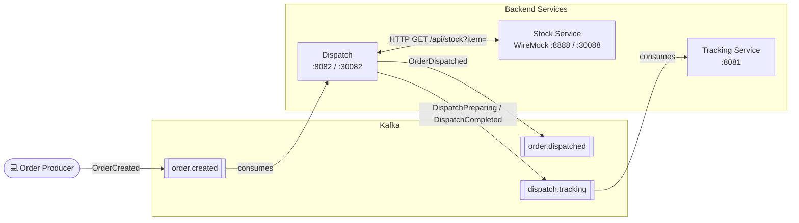

# Introduction to Kafka with Spring Boot

This repository contains the code to support the [Introduction to Kafka with Spring Boot](https://www.udemy.com/course/introduction-to-kafka-with-spring-boot/?referralCode=15118530CA63AD1AF16D) online course.

The application code is for a message driven service which utilises Kafka and Spring Boot 4.

## Architecture Overview



## Testing

This application is tested with the IntelliJ runner using the `docker` profile, which starts a Docker Kafka
instance via docker compose.

> Alternative: lokale Kafka-Installation (siehe [docs/Kafka.md](docs/Kafka.md))

### Docker-Profil

In IntelliJ die Run-Config **`DispatchApplication with Docker`** starten (aktives Profil `docker`). Über
`spring-boot-docker-compose` startet `compose.yaml` automatisch Kafka, WireMock und den Tracking-Service. Kafka ist
dann über `127.0.0.1:29092` erreichbar (siehe `src/main/resources/application-docker.yaml`).

Topics auflisten:

```bash
docker exec -it kafka /opt/kafka/bin/kafka-topics.sh --bootstrap-server localhost:29092 --list
```

Kafka-Shell öffnen:

```bash
docker exec -it kafka /bin/bash
```

Terminal 1: Consumer auf `order.created` starten

```bash
/opt/kafka/bin/kafka-console-consumer.sh --bootstrap-server localhost:9092 \
  --topic order.created --from-beginning --property print.headers=true
```

Terminal 2: `OrderCreated`-Event senden

```bash
echo '"123":{"orderId":"8ed0dc67-41a4-4468-81e1-960340d30c92","item":"first-item"}' \
 | /usr/bin/kafka-console-producer --bootstrap-server localhost:9092 --topic order.created \
   --property parse.key=true --property "key.separator=:"
```

Verifizieren:

- Actuator: `http://localhost:8082/actuator/health` bzw. `/actuator/info`.
- WireMock Admin: `http://localhost:8888/__admin/` (Kubernetes: `http://localhost:30088/__admin/`) — siehe
  [WireMock Admin API](https://wiremock.org/docs/standalone/admin-api-reference/#tag/Stub-Mappings).
- Trace/Baggage manuell auslösen: Requests aus `restRequest/actuator.http` (setzt `traceparent` und
  `baggage: testBaggage=dispatch`); Logs zeigen `[… traceId-spanId]` und `MDC={testBaggage=…}`.

### Deployment with Helm

Be aware that we are using a different namespace here (not default).

To run maven filtering for destination target/helm

```bash
./mvnw clean install -DskipTests
```

Go to the directory where the tgz file has been created after './mvnw install'

```powershell
cd target/helm/repo
```

unpack

```powershell
$file = Get-ChildItem -Filter dispatch-chart-*.tgz | Select-Object -First 1
tar -xvf $file.Name
```

install

```powershell
$APPLICATION_NAME = "dispatch"
helm upgrade --install $APPLICATION_NAME ./dispatch-chart --namespace dispatch --create-namespace --wait --timeout 8m --debug --render-subchart-notes
```

show logs

```powershell
kubectl get pods -l app.kubernetes.io/name=$APPLICATION_NAME -n dispatch
```

replace $POD with pods from the command above

```powershell
kubectl logs $POD -n dispatch --all-containers
```

test

```powershell
helm test $APPLICATION_NAME --namespace dispatch --logs
```

uninstall

```powershell
helm uninstall $APPLICATION_NAME --namespace dispatch
```

delete all

```powershell
kubectl delete all --all -n dispatch
```

create busybox sidecar

```powershell
kubectl run busybox-test --rm -it --image=busybox:1.38.0 --namespace=dispatch --command -- sh
```

and analyze kafka connections

```powershell
nslookup dispatch-kafka.dispatch.svc.cluster.local

nc -zv dispatch-kafka.dispatch.svc.cluster.local 29092
echo "Exit code for port 29092: $?"
```

create bitnamilegacy/kafka sidecar and open bash

```powershell
kubectl run kafka-test --rm -it --image=bitnamilegacy/kafka:3.9.0 --namespace=dispatch --command -- bash
```

run kafka commands

```powershell
cd /opt/bitnami/kafka/bin
./kafka-topics.sh --bootstrap-server dispatch-kafka.dispatch.svc.cluster.local:29092 --list
```

Send a OrderCreated-Message to topic order.created

```bash
echo '"123":{"orderId":"8ed0dc67-41a4-4468-81e1-960340d30c92","item":"first-item"}' | kafka-console-producer.sh \
--bootstrap-server dispatch-kafka.dispatch.svc.cluster.local:29092 \
--topic order.created \
--property parse.key=true \
--property "key.separator=:"
```

You can use the actuator rest call to verify via port 30082

## Sandbox (local dev environment)

The sandbox is provisioned by the opencode-sandbox-kit and runs as a Docker container. It mounts this
repo, starts the agent (opencode/Claude Code/Mammouth), and connects the IntelliJ MCP server.

Allow the kit source (GitHub without cloning):

```powershell
sbx settings set kit.allowedSources --% "[\"docker.io/\",\"github.com/dboeckli/\"]"
```

Start a new sandbox:

```powershell
sbx run opencode `
    --name dispatch `
    --static-mcp idea `
    -t docker/sandbox-templates:opencode-docker-0.5.0 `
    --kit "git+https://github.com/dboeckli/opencode-sandbox-kit.git#dir=opencode-agent" `
    "C:\development\projects\dispatch" `
    "C:\development\maven-repo:ro"
```

Start the sandbox with Kubernetes support:

```powershell
sbx run opencode `
    --name dispatch `
    --static-mcp idea `
    -t docker/sandbox-templates:opencode-docker-0.5.0 `
    --kit "git+https://github.com/dboeckli/opencode-sandbox-kit.git#dir=opencode-agent" `
    "C:\development\projects\dispatch" `
    "C:\development\maven-repo:ro" `
    "$env:USERPROFILE\.kube:ro"
```

Apply the kit to an existing sandbox (restarts the sandbox, VM state is kept):

```powershell
sbx kit add dispatch "git+https://github.com/dboeckli/opencode-sandbox-kit.git#dir=opencode-agent"
```

Claude Code / Mammouth variants: replace `opencode` by `claude` (template
`claude-code-docker-0.5.0`) or `mammouth` (kit `#dir=mammouth-agent`, template pin in the spec image).
The sandbox sets `npm_config_bin_links=false` globally, so no manual export is needed before
`./mvnw` (see `AGENTS.md`).

